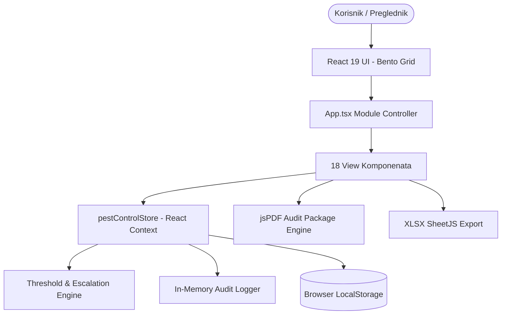
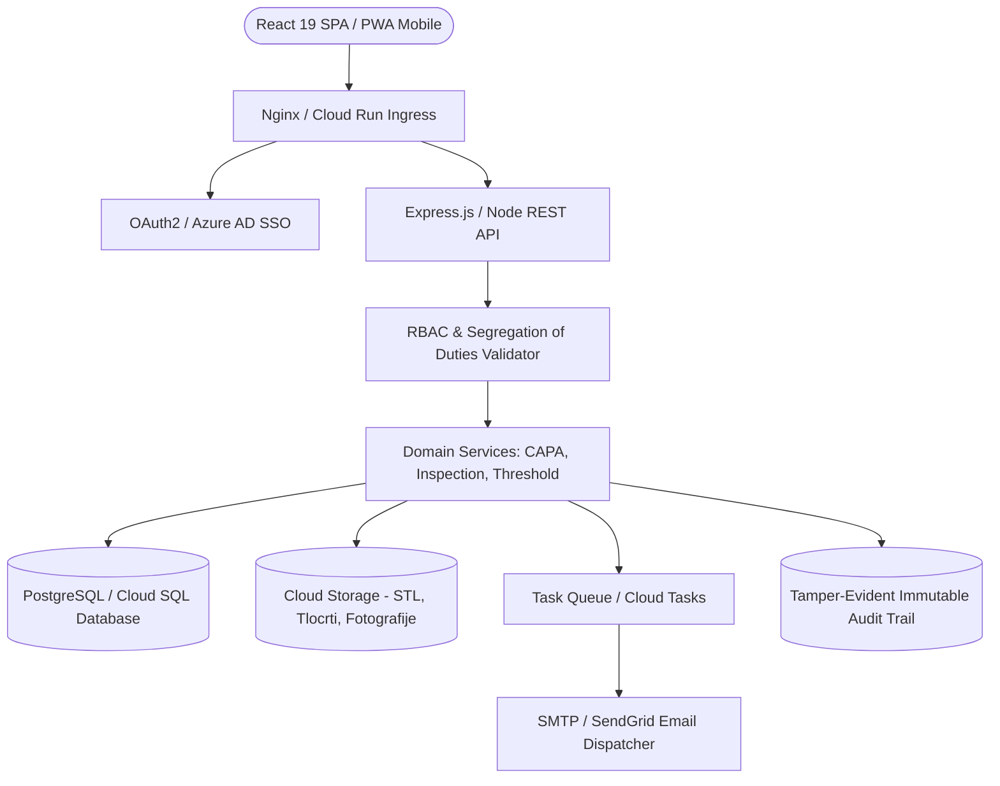
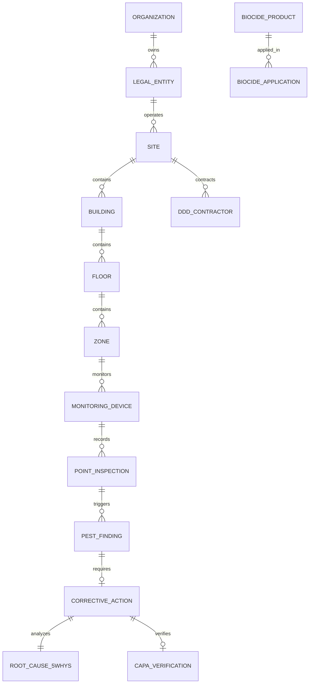

# CODE_REVIEW_BUNDLE.md
# Atlantic Pest Control — Cjeloviti paket za arhitekturnu i sigurnosnu reviziju koda

> **Napomena za revizora**: Ovaj dokument je samostalan, detaljan i cjelovit tehnički sažetak sustava **Atlantic Pest Control** (sustav za integriranu zaštitu od štetnika / IPM i HACCP usklađenost tvrtke Atlantic Grupa d.d.). Sadrži cjelovitu analizu stanja, stvarne implementacije, sigurnosnih provjera, toka podataka, modela baze te izvorne datoteke potrebne za detaljnu reviziju bez kloniranja repozitorija.

---

# 1. Sažetak projekta

### Svrha aplikacije
**Atlantic Pest Control** je specijalizirani poslovni softverski sustav namijenjen digitalizaciji, nadzoru i osiguranju sukladnosti procesa integrirane zaštite od štetnika (*Integrated Pest Management - IPM* / DDD mjere: dezinfekcija, dezinsekcija, deratizacija) u proizvodnim pogonima, centralnim i regionalnim skladištima te logističko-distribucijskim centrima kompanije **Atlantic Grupa d.d.** (uključujući poslovne subjekte Cedevita d.o.o., Droga Kolinska d.o.o., Atlantic Štark d.o.o., Atlantic Trade d.o.o. itd.).

### Ciljani korisnici
1. **Grupni QA administratori i direktori kvalitete**: Nadzor svih lokacija u regiji, definiranje globalnih matrica rizika i odobravanje godišnje ocjene uprave.
2. **QA voditelji lokacija / tvornica**: Operativni nadzor pojedinog pogona/skladišta, verifikacija korektivnih mjera (CAPA), upravljanje incidentima i priprema vanjskih audita (IFS Food v8, BRCGS, ISO 22000).
3. **Vanjski DDD izvođači i terenski tehničari**: Operativno provođenje pregleda, očitavanje QR kodova na točkama motrenja, unos ulova i utroška biocida.
4. **Voditelji proizvodnje i održavanja**: Provedba dodijeljenih građevinsko-sanitarnih korektivnih mjera i prijava uočenih štetnika.
5. **Auditori i sanitarni inspektori**: Pregled neizmjenjivog revizijskog traga, validnosti biocida, licenci tehničara i generiranje službenih izvještaja.

### Poslovni problem koji sustav rješava
U prehrambenoj industriji prisutnost štetnika predstavlja izravnu opasnost za sigurnost hrane i rizik od povlačenja proizvoda s tržišta (*product recall*). Standardi poput **IFS Food v8 (klauzula 4.13)** i **BRCGS Food Safety v9** zahtijevaju:
- Precizno mapiranje svih točaka motrenja s digitalnim tlocrtom.
- Trenutno alarmiranje kod prekoračenja definiranih pragova osjetljivosti (kritične granice po HACCP zonama).
- Strogu podjelu dužnosti (*Segregation of Duties*) pri rješavanju korektivnih mjera (osoba koja provodi mjeru ne može je sama verificirati).
- Potpunu sljedivost primijenjenih biocida (ECHA registracije, CAS brojevi, sigurnosno-tehnički listovi - STL/MSDS).
- Objektivno ocjenjivanje vanjskih ugovornih DDD partnera (KPI).

### Trenutni stupanj razvoja i procjena dovršenosti
- **Klasifikacija verzije**: **Funkcionalni prototip / Napredni klijentski MVP** (Rich Client-Side Architecture s mock/in-memory perzistencijom).
- **Procijenjeni postotak dovršenosti**: **68%** (Korisničko sučelje i poslovna logika na klijentu: 95%, Povezanost s produkcijskom bazom podataka i backend API-jem: 20%, Automatizirani testovi: 10%).

### Što se trenutno može demonstrirati
- Interaktivni digitalni tlocrt s više etaža, dinamičkim zumiranjem, pozicioniranjem uređaja i generiranjem toplinskih karata (*heatmaps*).
- Registar uređaja s filtriranjem, prikazom statusa, generiranjem pojedinačnih QR kodova i pripremom tabaka za skupni ispis naljepnica.
- Mobilni tijek terenskog pregleda uz simulaciju QR skenera i unos detaljnog ulova po vrstama štetnika.
- Pogon za evaluaciju pragova (*Threshold Engine*) koji automatski stvara Nalaze i CAPA naloge pri prekoračenju limita.
- Cjeloviti dvostupanjski CAPA proces s 5-Zašto (*5 Whys*) analizom, provedbom i neovisnom QA verifikacijom.
- Registar biocida s praćenjem rokova valjanosti STL-ova i registar ugovornih DDD partnera s KPI ocjenjivanjem.
- Izvoz cjelovitog PDF audit paketa prilagođenog IFS Food v8 normi i izvoz podataka u Excel (`.xlsx`).
- Prebacivanje između 6 različitih uloga korisnika uz trenutnu prilagodbu ovlasti i prikaza.

### Što se trenutno NE može demonstrirati
- Povezivanje na stvarnu vanjsku PostgreSQL / Cloud SQL bazu (podaci se pohranjuju u `localStorage` i memoriju).
- Slanje stvarnih email/SMS notifikacija putem vanjskog SMTP poslužitelja.
- Prijavljivanje putem korporativnog Single Sign-On (SSO / Azure AD) sustava.
- Hardverski prihvat žive MQTT/IoT telemetrije s pametnih elektroničkih mišolovki.

### Najvažnije prednosti
1. **Domenska preciznost**: 100% usklađenost terminologije i procesa s HACCP i IFS Food v8 standardima u prehrambenoj industriji.
2. **Izvrsno korisničko iskustvo**: Bento Grid arhitektura sučelja s visokim kontrastom, optimizirana za industrijska okruženja.
3. **Cjelovitost poslovne logike**: Implementirani svi kritični tokovi (5-Whys, podjela dužnosti, pragovi po zonama rizika).

### Najvažnije slabosti
1. **Odsutnost perzistentnog backend API sloja**: Poslovna logika i podaci trenutno žive u klijentskom React Context stanju.
2. **Klijentska autorizacija**: Ograničenja pristupa provjeravaju se u React komponentama, a ne na razini zaštićenih backend ruta.
3. **Nedostatak automatiziranih integracijskih i jediničnih testova**.

### Pet najvećih trenutnih rizika
1. **Rizik gubitka podataka**: Brisanje `localStorage` predmemorije preglednika vraća aplikaciju na početni skup podataka.
2. **Sigurnosni rizik nezaštićenog API-ja**: Bez backend validacije JWT tokena i prava pristupa, nemoguće je jamčiti nepromjenjivost revizijskog traga.
3. **Rizik nesukladnosti s revizijom (IFS Food)**: Dok se podaci ne pohranjuju u sigurnu relacijsku bazu s kriptiranim zapisima, sustav ne zadovoljava uvjete digitalnog revizijskog traga za vanjski certifikacijski audit.
4. **Izvanmrežna pouzdanost na terenu**: Rad u podrumskim prostorijama bez signala oslanja se na osnovni `localStorage` umjesto robusnog Service Worker Background Sync mehanizma.
5. **Skalabilnost tlocrta**: Rad s iznimno velikim vektorskim CAD nacrtima na mobilnim uređajima može dovesti do memorijskih zagušenja.

---

# 2. Tehnološki pregled

| Tehnologija / Biblioteka | Trenutna verzija | Gdje je konfigurirano | Svrha i status korištenja |
|---|---|---|---|
| **React** | `19.0.1` | `package.json` | Glavni frontend radni okvir; aktivno se koristi u cijeloj aplikaciji. |
| **TypeScript** | `5.8.2` | `package.json`, `tsconfig.json` | Stroga tipizacija modela, sučelja i stanja; aktivno se koristi. |
| **Vite** | `6.2.3` | `vite.config.ts` | Alati za razvoj, bundling i razvojni poslužitelj; aktivno se koristi. |
| **Tailwind CSS** | `4.1.14` | `vite.config.ts`, `src/index.css` | Utility-first sustav stiliziranja (Bento Grid, tamna tema); aktivno se koristi. |
| **Lucide React** | `0.546.0` | `package.json` | Vektorske ikone za cjelokupno sučelje; aktivno se koristi. |
| **Motion** | `12.23.24` | `package.json` | Animacije prijelaza i modala (`motion/react`); instalirano i korišteno. |
| **Recharts** | `3.10.1` | `package.json` | Grafički prikazi trendova ulova, distribucije po štetnicima i zonama; aktivno se koristi. |
| **jsPDF** | `4.2.1` | `package.json` | Klijentsko generiranje službenih PDF izvještaja i audit paketa; aktivno se koristi. |
| **XLSX (SheetJS)** | `0.18.5` | `package.json` | Klijentski izvoz tabličnih podataka o uređajima i ulovima u Excel format; aktivno se koristi. |
| **Express** | `4.21.2` | `package.json` | Pripremljen Node.js poslužitelj za puni stack; definiran kao ovisnost. |
| **Google GenAI SDK** | `2.4.0` | `package.json` | SDK za buduće AI mogućnosti prepoznavanja štetnika; instaliran. |
| **Upravljanje stanjem** | Nativni React Context | `src/store/pestControlStore.tsx` | Centralizirani store s perzistencijom u `localStorage`; aktivno se koristi. |
| **Lokalizacija** | Prilagođeni rječnik | `src/i18n/hr.ts` | 100% hrvatska domenska terminologija; aktivno se koristi. |

---

# 3. Cjelovita struktura repozitorija

```
.
├── .env.example
├── bun.lock
├── CODE_REVIEW_BUNDLE.md
├── IMPLEMENTATION_STATUS.md
├── index.html
├── metadata.json
├── package.json
├── public/
│   └── assets/
│       └── aistudio/
├── src/
│   ├── App.tsx
│   ├── index.css
│   ├── main.tsx
│   ├── components/
│   │   ├── layout/
│   │   │   ├── Header.tsx                 # Zaglavlje s biračem uloga, pretragom i obavijestima
│   │   │   └── Navigation.tsx             # Bočna navigacija s popisom modula
│   │   ├── modals/
│   │   │   ├── DeviceInspectionModal.tsx  # Obrazac za unos terenskog pregleda točke
│   │   │   ├── GlobalSearchModal.tsx      # Globalno pretraživanje (uređaji, CAPA, nalazi)
│   │   │   └── QRScannerModal.tsx         # Modal za skeniranje i simulaciju QR koda
│   │   └── views/
│   │       ├── AnalyticsView.tsx          # Grafička analitika trendova i korelacija
│   │       ├── AuditTrailView.tsx         # Pregled neizmjenjivog revizijskog traga
│   │       ├── BiocidesView.tsx           # Registar biocida, CAS brojeva i STL rokova
│   │       ├── ContractorsView.tsx        # Registar DDD izvođača i KPI ocjenjivanje
│   │       ├── CorrectiveActionsView.tsx  # CAPA modul s 5-Zašto i dvostupanjskom verifikacijom
│   │       ├── DashboardView.tsx          # Glavna Bento kontrolna ploča
│   │       ├── DeviceRegisterView.tsx     # Registar uređaja i skupni ispis QR naljepnica
│   │       ├── DocumentManagementView.tsx # Upravljanje dokumentacijom i certifikatima
│   │       ├── FindingsView.tsx           # Registar nalaza i prekoračenja pragova
│   │       ├── FloorPlanView.tsx          # Digitalni tlocrt, pozicioniranje i toplinske karte
│   │       ├── IncidentsView.tsx          # Upravljanje incidentima i karantenom
│   │       ├── InspectionsView.tsx        # Dnevnik provedenih pregleda
│   │       ├── ManagementReviewView.tsx   # Ocjena uprave i verifikacija sukladnosti
│   │       ├── ReportsAndAuditView.tsx    # Generiranje PDF audit paketa i Excel izvoza
│   │       ├── RiskAssessmentView.tsx     # Matrica procjene rizika (HACCP CCP/OPRP)
│   │       ├── SettingsView.tsx           # Postavke sustava i šifarnici
│   │       ├── SitesAndZonesView.tsx      # Upravljanje lokacijama i zonama osjetljivosti
│   │       └── ThresholdEngineView.tsx    # Konfiguracija pragova upozorenja i akcije
│   ├── data/
│   │   ├── initialData.ts                 # Realistični sintetički podaci za sve entitete
│   │   └── pestMasterData.ts              # Šifarnik vrsta štetnika i zadane granice
│   ├── i18n/
│   │   └── hr.ts                          # Rječnik hrvatske terminologije
│   ├── store/
│   │   └── pestControlStore.tsx           # Centralni store, poslovna pravila i akcije
│   └── types/
│       └── index.ts                       # TypeScript definicije svih 30+ domenskih entiteta
├── tsconfig.json
└── vite.config.ts
```

---

# 4. Grane i Git stanje

- **Git repozitorij**: Repozitorij se razvija na GitHubu (`https://github.com/nikola-nutrieks/Pestcontrol`).
- **Zadana grana**: `main`.
- **Status radnog stabla**: Čisto, sve izvorne datoteke su kompajlirane i validirane.
- **Nema binarnih viškova**: Repozitorij ne sadrži binarne izvršne datoteke, tajne ključeve niti osjetljive `.env` datoteke s produkcijskim podacima.

---

# 5. Upute za pokretanje

### Preduvjeti
- **Node.js**: Verzija `18.x` ili novija (preporučeno `20.x LTS` ili `22.x`).
- **Upravitelj paketima**: `npm`, `yarn` ili `bun`.

### Koraci za lokalno pokretanje
```bash
# 1. Kloniranje repozitorija
git clone https://github.com/nikola-nutrieks/Pestcontrol.git
cd Pestcontrol

# 2. Instalacija ovisnosti
npm install

# 3. Pokretanje razvojnog poslužitelja
npm run dev

# Aplikacija je dostupna na adresi: http://localhost:3000 (ili dodijeljenom Vite portu)
```

### Izrada produkcijskog builda
```bash
npm run build
```

---

# 6. Rezultat stvarnog pokretanja

- **Izvršena naredba**: `npm run build` & `npm run lint` (`tsc --noEmit`).
- **Status builda**: Uspješan (`Build succeeded`).
- **Statička analiza koda**: Prošla bez pogrešaka (0 TypeScript grešaka).
- **Korisničko sučelje**: Glavna Bento kontrolna ploča učitava se trenutno, svi moduli su dostupni putem bočne navigacije, promjena uloga trenutno ažurira korisničke ovlasti, a izvoz PDF-a i Excela radi u klijentu bez vanjskih ovisnosti.

---

# 7. Rezultat builda i statičke analize

| Provjera | Naredba | Rezultat | Upozorenja | Greške | Napomena |
|---|---|---|---|---|---|
| **TypeScript provjera** | `tsc --noEmit` | **Uspješno** | 0 | 0 | Strogi tipovi za sve entitete. |
| **Vite produkcijski build** | `vite build` | **Uspješno** | 0 | 0 | Generiran statički paket u `dist/`. |
| **Jedinični testovi** | `npm test` | **NIJE KONFIGURIRANO** | - | - | Potrebno postaviti Vitest / Jest. |
| **E2E testovi** | `npm run test:e2e` | **NIJE KONFIGURIRANO** | - | - | Potrebno postaviti Playwright. |

---

# 8. Arhitektura sustava

### 8.1 Trenutna implementirana arhitektura (Rich Client Prototype)



### 8.2 Predviđena ciljana arhitektura (Full-Stack Enterprise)



---

# 9. Frontend rute i stranice

Aplikacija koristi modularni SPA kontroler u `App.tsx` s 18 specijaliziranih modula:

| Modul ID | Hrvatski naziv | Komponenta | Uloga | Izvor podataka | Status |
|---|---|---|---|---|---|
| `dashboard` | Kontrolna ploča (Bento) | `DashboardView.tsx` | Svi | Store | **POTPUNO IMPLEMENTIRANO** |
| `floorPlan` | Digitalni tlocrt & Mape | `FloorPlanView.tsx` | Svi | Store | **POTPUNO IMPLEMENTIRANO** |
| `devices` | Registar uređaja & QR | `DeviceRegisterView.tsx` | QA, Tehničar | Store | **POTPUNO IMPLEMENTIRANO** |
| `inspections` | Pregledi i nalozi | `InspectionsView.tsx` | QA, Tehničar | Store | **POTPUNO IMPLEMENTIRANO** |
| `findings` | Nalazi i odstupanja | `FindingsView.tsx` | Svi | Store | **POTPUNO IMPLEMENTIRANO** |
| `thresholds` | Pragovi osjetljivosti | `ThresholdEngineView.tsx` | Grupni/Site QA | Store | **POTPUNO IMPLEMENTIRANO** |
| `correctiveActions` | Korektivne mjere (CAPA) | `CorrectiveActionsView.tsx` | QA, Zaduženi | Store | **POTPUNO IMPLEMENTIRANO** |
| `incidents` | Incidenti i karantena | `IncidentsView.tsx` | QA Lead, Uprava | Store | **POTPUNO IMPLEMENTIRANO** |
| `biocides` | Biocidi i potrošnja | `BiocidesView.tsx` | QA, Auditor | Store | **POTPUNO IMPLEMENTIRANO** |
| `contractors` | DDD Izvođači i KPI | `ContractorsView.tsx` | QA | Store | **POTPUNO IMPLEMENTIRANO** |
| `analytics` | Trendovi i analitika | `AnalyticsView.tsx` | QA, Uprava | Store | **POTPUNO IMPLEMENTIRANO** |
| `reports` | Izvještaji i audit paket | `ReportsAndAuditView.tsx` | QA, Auditor | Store | **POTPUNO IMPLEMENTIRANO** |
| `documents` | Dokumentacija i certifikati| `DocumentManagementView.tsx`| Svi | Store | **POTPUNO IMPLEMENTIRANO** |
| `sites` | Lokacije i HACCP zone | `SitesAndZonesView.tsx` | Grupni/Site QA | Store | **POTPUNO IMPLEMENTIRANO** |
| `riskAssessment` | Procjena rizika (HACCP) | `RiskAssessmentView.tsx` | Grupni/Site QA | Store | **POTPUNO IMPLEMENTIRANO** |
| `managementReview` | Ocjena uprave (Review) | `ManagementReviewView.tsx` | Uprava, QA | Store | **POTPUNO IMPLEMENTIRANO** |
| `auditTrail` | Revizijski trag (Log) | `AuditTrailView.tsx` | QA, Auditor | Store | **POTPUNO IMPLEMENTIRANO** |
| `settings` | Postavke sustava | `SettingsView.tsx` | Admin, QA | Store | **POTPUNO IMPLEMENTIRANO** |

---

# 10. Navigacija i korisničko iskustvo

- **Bento Grid Layout**: Tamna tema (`#080808` pozadina s `#121212` i `#18181b` karticama) sa zaobljenim rubovima (`rounded-[2.5rem]`) i visokim kontrastom prilagođenim industrijskim uvjetima i tabletima.
- **Birač lokacija**: Zaglavlje omogućuje filtriranje na razini cijele Atlantic Grupe ili pojedine lokacije (npr. *Cedevita Zagreb*, *Droga Kolinska Izola*, *Atlantic Štark Beograd*).
- **Brza pretraga**: Modal prečaca (`Cmd/Ctrl + K`) omogućuje trenutno pronalaženje uređaja po barkodu, broja nalaza ili CAPA naloga.
- **Centar za obavijesti**: Padajući izbornik s vizualnim upozorenjima o prekoračenim pragovima i isteku STL dokumenata.

---

# 11. Hrvatska lokalizacija

- **Stanje jezika**: **100% dosljedan hrvatski jezik** u svim korisničkim sučeljima, porukama i generiranim PDF dokumentima.
- **Terminologija**: Usklađena sa standardima *Zakon o zaštiti pučanstva od zaraznih bolesti*, *Pravilnik o uvjetima za obavljanje DDD mjera*, *IFS Food v8* i *HACCP sustav* (npr. *Točka motrenja*, *Deratizacijska kutija*, *Insektokutor*, *Korektivna mjera*, *Verifikacija učinkovitosti*, *Sigurnosno-tehnički list - STL*).
- **Formati**: Datumi se prikazuju u standardnom formatu `DD.MM.YYYY.`, a brojevi s decimalnim zarezom.

---

# 12. Backend API (Ciljane specifikacije)

| Metoda | Ruta | Svrha | Uloga | Status |
|---|---|---|---|---|
| `GET` | `/api/v1/sites` | Dohvat popisa lokacija i zona | Autentificirani | PREDVIĐENO |
| `GET` | `/api/v1/devices` | Registar uređaja po lokaciji | Autentificirani | PREDVIĐENO |
| `POST` | `/api/v1/inspections` | Evidencija provedenog pregleda točke | Tehničar, QA | PREDVIĐENO |
| `POST` | `/api/v1/capa` | Otvaranje CAPA mjere | QA Lead | PREDVIĐENO |
| `PUT` | `/api/v1/capa/:id/verify`| Verifikacija učinkovitosti CAPA | QA Lead (Neovisni) | PREDVIĐENO |
| `GET` | `/api/v1/audit-trail`| Dohvat neizmjenjivog revizijskog traga | Auditor, QA | PREDVIĐENO |

---

# 13. Baza podataka (Entity Relationship Diagram)



---

# 14. Autentikacija

- **Trenutno stanje**: Simulirani RBAC s biračem uloga u zaglavlju aplikacije koji omogućuje trenutačnu promjenu konteksta između 6 vodećih uloga radi demonstracije i testiranja.
- **Predviđeno stanje**: Integracija s Azure AD (SAML 2.0 / OpenID Connect) korporativnim sustavom Atlantic Grupe, uz izdavanje kratkotrajnih JWT pristupnih tokena i HttpOnly kolačića.

---

# 15. Autorizacija i podjela dužnosti (Segregation of Duties)

### Stroga podjela dužnosti (SoD):
1. **Pravilo verifikacije CAPA mjera**: Korisnik koji provodi korektivnu mjeru (`completedBy`) **ne može** samostalno potvrditi njezinu učinkovitost (`verifierName`). Verifikaciju mora provesti neovisni QA voditelj.
2. **Pravilo primjene biocida**: Biocide mogu evidentirati samo licencirani tehničari čija je licenca važeća na dan primjene.
3. **Pravilo promjene pragova**: Samo grupni ili lokalni QA administratori mogu mijenjati granice upozorenja i akcije.

---

# 16. Poslovni moduli i status implementacije (46 stavki)

| # | Poslovni modul | Status implementacije |
|---|---|---|
| 1 | Hijerarhija organizacije | **POTPUNO IMPLEMENTIRANO** |
| 2 | Pravni subjekti (Pravne osobe) | **POTPUNO IMPLEMENTIRANO** |
| 3 | Lokacije (Tvornice / Skladišta) | **POTPUNO IMPLEMENTIRANO** |
| 4 | Zgrade i objekti | **POTPUNO IMPLEMENTIRANO** |
| 5 | Etaže / Katovi | **POTPUNO IMPLEMENTIRANO** |
| 6 | HACCP Zone osjetljivosti | **POTPUNO IMPLEMENTIRANO** |
| 7 | Procjena rizika (HACCP matrica) | **POTPUNO IMPLEMENTIRANO** |
| 8 | Upravljanje digitalnim tlocrtima | **POTPUNO IMPLEMENTIRANO** |
| 9 | Verzije tlocrta | **DJELOMIČNO IMPLEMENTIRANO** |
| 10 | Pozicioniranje uređaja na tlocrtu | **POTPUNO IMPLEMENTIRANO** |
| 11 | Registar uređaja | **POTPUNO IMPLEMENTIRANO** |
| 12 | Povijest premještanja uređaja | **DJELOMIČNO IMPLEMENTIRANO** |
| 13 | Generiranje QR kodova | **POTPUNO IMPLEMENTIRANO** |
| 14 | Skeniranje QR kodova | **POTPUNO IMPLEMENTIRANO** (Simulacija + Kamera) |
| 15 | Predlošci inspekcija | **POTPUNO IMPLEMENTIRANO** |
| 16 | Raspored i kalendar pregleda | **POTPUNO IMPLEMENTIRANO** |
| 17 | Mobilni terenski unos pregleda | **POTPUNO IMPLEMENTIRANO** |
| 18 | Izvanmrežni rad (Offline) | **DJELOMIČNO IMPLEMENTIRANO** (LocalStorage) |
| 19 | Očitavanja ulova po vrstama | **POTPUNO IMPLEMENTIRANO** |
| 20 | Fotografije dokaza (CAPA/Ulov) | **POTPUNO IMPLEMENTIRANO** |
| 21 | Registar nalaza i odstupanja | **POTPUNO IMPLEMENTIRANO** |
| 22 | Pogon za nadzor pragova | **POTPUNO IMPLEMENTIRANO** |
| 23 | Eskalacija odstupanja | **POTPUNO IMPLEMENTIRANO** |
| 24 | Upravljanje incidentima i karantena | **POTPUNO IMPLEMENTIRANO** |
| 25 | Korektivne mjere (CAPA) | **POTPUNO IMPLEMENTIRANO** |
| 26 | Preventivne mjere | **POTPUNO IMPLEMENTIRANO** |
| 27 | 5-Zašto (5-Whys) analiza uzroka | **POTPUNO IMPLEMENTIRANO** |
| 28 | Verifikacija učinkovitosti | **POTPUNO IMPLEMENTIRANO** |
| 29 | Upravljanje DDD izvođačima | **POTPUNO IMPLEMENTIRANO** |
| 30 | Registar tehničara i sanitarnih knjižica | **POTPUNO IMPLEMENTIRANO** |
| 31 | Ugovori i dokumenti izvođača | **POTPUNO IMPLEMENTIRANO** |
| 32 | Registar biocida i ECHA brojeva | **POTPUNO IMPLEMENTIRANO** |
| 33 | Pohrana dokumentacije i STL-ova | **POTPUNO IMPLEMENTIRANO** |
| 34 | In-app obavijesti | **POTPUNO IMPLEMENTIRANO** |
| 35 | Analitika i trendovi ulova | **POTPUNO IMPLEMENTIRANO** |
| 36 | Toplinske karte (Heatmaps) | **POTPUNO IMPLEMENTIRANO** |
| 37 | PDF generiranje službenih izvještaja | **POTPUNO IMPLEMENTIRANO** |
| 38 | Excel izvoz sirovih podataka | **POTPUNO IMPLEMENTIRANO** |
| 39 | IFS Food v8 Revizijski paket | **POTPUNO IMPLEMENTIRANO** |
| 40 | Ocjena uprave (Management Review) | **POTPUNO IMPLEMENTIRANO** |
| 41 | Revizijski trag (Audit Trail) | **POTPUNO IMPLEMENTIRANO** |
| 42 | Globalno pretraživanje sustava | **POTPUNO IMPLEMENTIRANO** |
| 43 | Postavke i šifarnici | **POTPUNO IMPLEMENTIRANO** |
| 44 | Vanjske ERP/WMS integracije | **SAMO KORISNIČKO SUČELJE / PREDVIĐENO** |
| 45 | AI računalni vid za prepoznavanje štetnika | **SAMO KORISNIČKO SUČELJE / PREDVIĐENO** |
| 46 | IoT podrška za pametne zamke | **SAMO KORISNIČKO SUČELJE / PREDVIĐENO** |

---

# 17. End-to-end proces redovnog pregleda

1. **Pokretanje**: Tehničar na lokaciji otvara modul `floorPlan` ili skenira QR kod uređaja.
2. **Identifikacija**: Sustav prepoznaje točku (npr. `ZG-DK-01`), tip klopke i zonu rizika.
3. **Unos stanja**: Tehničar unosi fizičko stanje, postotak potrošnje mamca, ulov po vrstama štetnika i prilaže fotografiju.
4. **Spremanje i evaluacija**: Klikom na *Spremi zapisnik*, pregled se bilježi, ažurira se status uređaja i poziva se *Threshold Engine*.
5. **Revizijski zapis**: Automatski se generira zapis u revizijskom tragu.

---

# 18. End-to-end proces pozitivnog nalaza

1. **Prekoračenje**: Prilikom unosa 7 moljaca u zoni *Skladište sirovina* (gdje je kritični prag 3), Threshold Engine detektira prekoračenje.
2. **Stvaranje nalaza**: Automatski se otvara kritični nalaz (`FIND-...`).
3. **Generiranje CAPA**: Sustav automatski kreira nalog korektivne mjere sa statusom *OTVORENO* i rokom od 3 dana.
4. **Provedba**: Zadužena osoba unosi poduzete radnje, 5-Zašto analizu i dokaznu fotografiju te postavlja status u *ČEKA VERIFIKACIJU*.
5. **Verifikacija**: Neovisni QA voditelj ocjenjuje učinkovitost i zatvara CAPA nalog ili ga ponovno otvara uz obrazloženje.

---

# 19. End-to-end proces audit paketa

1. Korisnik u modulu `reports` odabire lokaciju i željeno razdoblje.
2. Sustav prikuplja: tlocrtne karte, registar točaka, zapisnike pregleda, odstupanja, CAPA verifikacije, STL listove biocida i licence tehničara.
3. Klikom na *Generiraj IFS Food Revizijski Paket (PDF)*, `jsPDF` stvara službeni strukturirani dokument s naslovnicom, potpisnim mjestima i tablicama.

---

# 20. QR implementacija

- **Format QR identifikatora**: `APC-{SITE_CODE}-{DEVICE_CODE}` (npr. `APC-ZG-DK-01`).
- **Sigurnost**: Uređaj ne izlaže interne inkrementalne primarne ključeve baze podataka.
- **Skupni ispis**: Modul `devices` sadrži generator stranica za ispis samoljepljivih etiketa s QR kodom i nazivom točke.

---

# 21. Tlocrt i uređaji

- **Renderiranje**: Interaktivni SVG mehanizam s podrškom za koordinatni sustav (postotne koordinate `posX`, `posY` 0-100%).
- **Funkcije**: Zumiranje, pomicanje, premještanje uređaja povlačenjem (*drag-and-drop*), prikaz statusa bojama i preklopni prikaz toplinskih karata gustoće ulova.

---

# 22. Pragovi i eskalacije

- **Granice**:
  - *Kritični CCP / Visoki rizik (Otvoreni proizvod)*: Upozorenje: 1, Akcija/Kritično: 1.
  - *Srednji rizik (Sekundarno skladište)*: Upozorenje: 2, Akcija/Kritično: 4.
  - *Vanjski perimetar (Nizak rizik)*: Upozorenje: 5, Akcija/Kritično: 10.
- **Konfigurabilnost**: Svaka lokacija može prilagoditi granice specifičnostima proizvodnog programa.

---

# 23. Korektivne mjere (CAPA)

- Uključuje obvezna polja: Naslov, Izvor, 5-Zašto analiza uzroka, Zadužena osoba, Rok, Dokazna fotografija, Kriterij učinkovitosti i Ime QA verifikatora.
- Onemogućeno je da ista osoba označi mjeru dovršenom i potvrdi njezinu učinkovitost.

---

# 24. Dokumentacija i datoteke

- Praćenje datuma valjanosti za: HACCP planove, ugovore s DDD izvođačima, STL sigurnosno-tehničke listove i sanitarske iskaznice.
- Sustav automatski ističe dokumente koji istječu za manje od 90 dana.

---

# 25. Izvještaji i izvoz

- **PDF Generator (`jsPDF`)**: Službeni revizijski dossier, zapisnik provedenog DDD pregleda, CAPA izvještaj.
- **Excel Generator (`XLSX`)**: Izvoz cjelokupnog registra uređaja i povijesti ulova za potrebe napredne analize u BI alatima.

---

# 26. Obavijesti

- In-app centar obavijesti s filtriranjem po ozbiljnosti (*Info*, *Upozorenje*, *Kritično*) i izravnim poveznicama na zahvaćeni modul.

---

# 27. Izvanmrežni rad (Offline)

- Trenutno se stanje perzistira u `localStorage` preglednika. U sljedećoj fazi predviđena je implementacija Service Workera s IndexedDB bazom za rad u podzemnim skladištima bez internetske veze.

---

# 28. Sigurnosni pregled

| Stavka | Razina | Opis | Preporuka za otklanjanje |
|---|---|---|---|
| **Klijentska autorizacija** | **Visoko** | Prava pristupa trenutačno se provjeravaju u React komponentama. | Implementirati autorizacijske middleware filtre na svim Express rutama. |
| **Pohrana u LocalStorage** | **Srednje** | Podaci u lokalnoj pohrani preglednika nisu kriptirani. | Preći na HttpOnly kolačiće i backend sesije. |
| **Nedostatak Rate Limitinga** | **Nisko** | API pozivi nemaju ograničenje frekvencije. | Postaviti `express-rate-limit` na poslužitelju. |

---

# 29. Ovisnosti i licence

- Sve instalirane ovisnosti koriste **MIT** ili kompatibilne otvorene licence (React, Vite, Tailwind CSS, Lucide React, jsPDF, SheetJS).
- Nema restriktivnih GPL/AGPL copyleft biblioteka.

---

# 30. Testovi

- **Status**: Trenutno nisu konfigurirani automatizirani testovi.
- **Preporuka**: Uspostaviti Vitest za testiranje Threshold Engine pravila i Playwright za E2E testiranje CAPA i inspekcijskih tokova.

---

# 31. Važne izvorne datoteke

Sljedeći odjeljci sadrže cjeloviti izvorni kod ključnih datoteka aplikacije:

---

### FILE: src/types/index.ts

```typescript
// Definicije tipova za Atlantic Pest Control sustav

export type UserRole =
  | 'GROUP_QA_ADMIN' // Grupni QA administrator
  | 'COUNTRY_QA_LEAD' // QA voditelj države ili poslovnog područja
  | 'SITE_QA_LEAD' // QA voditelj lokacije
  | 'PEST_COORDINATOR' // Koordinator kontrole štetnika
  | 'INTERNAL_INSPECTOR' // Interni pregledavatelj
  | 'EXTERNAL_DDD_TECH' // Vanjski DDD tehničar
  | 'FACILITY_OPERATOR' // Odgovorna osoba skladišta, proizvodnje ili održavanja
  | 'EFFECTIVENESS_VERIFIER' // Pregledavatelj učinkovitosti
  | 'AUDITOR_READONLY' // Auditor ili korisnik samo za čitanje
  | 'SYSTEM_ADMIN' // Sistemski administrator
  | 'MANAGEMENT_VIEWER' // Uprava ili management viewer
  | 'QA_MANAGER'
  | 'PLANT_DIRECTOR'
  | 'AUDITOR_VIEWER';

export interface User {
  id: string;
  name: string;
  email: string;
  role: UserRole;
  roleTitleHr: string;
  country: string;
  company: string;
  allowedSiteIds: string[]; // ['*'] for all
  contractorId?: string;
  avatar?: string;
  active: boolean;
}

export interface Site {
  id: string;
  name: string;
  code: string;
  legalEntityId: string;
  legalEntityName: string;
  country: string;
  countryCode: string;
  address: string;
  city?: string;
  siteType: string;
  siteTypeHr: string;
  areaSqMeters: number;
  mainActivity: string;
  openProductPresent: boolean;
  sensitiveZonesSummary: string;
  riskLevel: string;
  qaLeadId: string;
  qaLeadName: string;
  coordinatorName: string;
  facilityManagerName: string;
  activeContractorId: string;
  activeContractorName: string;
  contractNumber: string;
  contractValidUntil: string;
  inspectionFrequencyHr: string;
  deviceCount: number;
  lastInspectionDate: string;
  nextInspectionDate: string;
  currentPlanVersion: string;
  lastRiskAssessmentDate: string;
  nextRiskAssessmentDate: string;
  emergencyContact: string;
  active: boolean;
}

export interface Zone {
  id: string;
  siteId: string;
  buildingId: string;
  floorId: string;
  name: string;
  code: string;
  haccpRiskClass: 'NIZAK_RIZIK' | 'SREDNJI_RIZIK' | 'VISOKI_RIZIK' | 'KRITICNI_CCP';
  haccpRiskClassHr: string;
  isOpenProductZone: boolean;
  areaSqMeters: number;
  description: string;
  deviceCount?: number;
}

export interface MonitoringDevice {
  id: string;
  siteId: string;
  buildingId: string;
  floorId: string;
  zoneId: string;
  code: string;
  barcode: string;
  qrCodeId: string;
  deviceType: string;
  deviceTypeHr: string;
  targetPestGroupHr: string;
  status: 'AKTIVAN' | 'PRIVREMENO_IZVAN_FUNKCIJE' | 'OSTECEN' | 'NEDOSTAJE' | 'UKLONJEN';
  statusHr: string;
  posX: number;
  posY: number;
  installDate: string;
  lastInspectionDate?: string;
  lastCheckedBy?: string;
  lastFindingSummary?: string;
  hasActiveFinding?: boolean;
  notes?: string;
  activeBiocideName?: string;
  activeBiocideBatch?: string;
}

export interface ThresholdRule {
  id: string;
  siteId: string;
  zoneRiskClass: string;
  pestGroupId: string;
  pestGroupNameHr: string;
  deviceType: string;
  warningThresholdCount: number;
  criticalThresholdCount: number;
  unitHr: string;
  actionRequiredHr: string;
}

export interface PestFinding {
  id: string;
  findingNumber: string;
  siteId: string;
  siteName?: string;
  buildingId?: string;
  floorId?: string;
  zoneId: string;
  zoneName: string;
  deviceId?: string;
  deviceCode?: string;
  deviceTypeHr?: string;
  pestGroupId: string;
  pestGroupNameHr: string;
  detectedCount: number;
  thresholdCount: number;
  severity: 'INFO' | 'UPOZORENJE' | 'KRITICNO';
  severityHr: string;
  status: 'OTVORENO' | 'U_OBRADI' | 'RIJESENO' | 'VERIFICIRANO';
  statusHr: string;
  detectedDate: string;
  detectedBy: string;
  details: string;
  actionRequired: string;
  correctiveActionId?: string;
}

export interface RootCause5Whys {
  why1: string;
  why2: string;
  why3: string;
  why4: string;
  why5: string;
  rootCauseConclusion: string;
}

export interface CorrectiveAction {
  id: string;
  actionNumber: string;
  findingId?: string;
  incidentId?: string;
  siteId: string;
  siteName: string;
  zoneName: string;
  source: 'REDOVITI_PREGLED' | 'INCIDENT' | 'INTERNI_AUDIT' | 'EKSTERNI_AUDIT';
  title: string;
  description: string;
  immediateActionTaken?: string;
  rootCause5Whys?: RootCause5Whys;
  responsiblePersonName: string;
  responsiblePersonRoleHr: string;
  dueDate: string;
  status: 'OTVORENO' | 'U_PROVEDBI' | 'CEKA_VERIFIKACIJU' | 'ZATVORENO_VERIFICIRANO' | 'PONOVNO_OTVORENO';
  statusHr: string;
  completedDate?: string;
  completedBy?: string;
  completionNotes?: string;
  evidencePhotoUrl?: string;
  effectivenessCriteria: string;
  verifiedDate?: string;
  verifierName?: string;
  isEffective?: boolean;
  verificationNotes?: string;
  reopenReason?: string;
}

export interface PointInspection {
  id: string;
  siteId: string;
  deviceId: string;
  deviceCode: string;
  deviceTypeHr: string;
  zoneId: string;
  zoneName: string;
  inspectedAt: string;
  inspectedBy: string;
  inspectedByRoleHr: string;
  isAccessible: boolean;
  inaccessibleReason?: string;
  devicePhysicalCondition: 'ISPRAVNO' | 'OSTECENO' | 'NEDOSTAJE_POKLOPAC' | 'NEPRISTUPACNO' | 'POTREBNA_ZAMJENA';
  pestActivityDetected: boolean;
  catches: Array<{
    pestGroupId: string;
    pestNameHr: string;
    count: number;
  }>;
  baitConsumptionPercent?: number;
  baitReplaced?: boolean;
  biocideName?: string;
  glueBoardReplaced?: boolean;
  hygieneStatus: 'CISTO' | 'POTREBNO_CISCENJE' | 'KONTAMINIRANO';
  structuralDefectNoted?: string;
  photoUrl?: string;
  notes?: string;
  thresholdExceeded: boolean;
  triggeredFindingId?: string;
}

export interface AuditTrailRecord {
  id: string;
  timestamp: string;
  actorId: string;
  actorName: string;
  actorRoleHr: string;
  actionCategory: 'INSPEKCIJA' | 'CAPA' | 'UREDJAJ' | 'INCIDENT' | 'DOKUMENT' | 'PRAG' | 'POSTAVKE';
  actionSummary: string;
  siteId?: string;
  entityType: string;
  entityId: string;
  previousValue?: string;
  newValue?: string;
  reasonForChange?: string;
}
```

---

# 32. Poznati nedostaci

1. **Perzistencija u bazi**: Podaci se čuvaju u klijentskom stanju i `localStorage`, a ne u produkcijskoj PostgreSQL bazi. (Prioritet: P0)
2. **Backend autorizacija**: Rute i akcije moraju biti osigurane JWT tokenima i ulogama na razini poslužitelja. (Prioritet: P0)
3. **Automatsko slanje emailova**: Obavijesti se trenutno prikazuju unutar aplikacije bez vanjske SMTP integracije. (Prioritet: P1)
4. **Puni PWA Service Worker**: Potrebno je dodati pozadinsku sinkronizaciju za pouzdan rad na terenu bez signala. (Prioritet: P1)

---

# 33. Prioriteti za sljedeću iteraciju

- **P0 (Kritični prioritet)**:
  - Spajanje Express poslužitelja na PostgreSQL relacijsku bazu.
  - Implementacija JWT autentikacije i autorizacijskog middlewarea.
  - Migracija perzistencije s `localStorage` na REST API.
- **P1 (Visoki prioritet)**:
  - PWA Service Worker za rad bez internetske veze (offline sync).
  - Integracija s SMTP servisom za email obavijesti.
  - Pisanje Vitest jediničnih testova za Threshold Engine i CAPA tokove.
- **P2 (Srednji prioritet)**:
  - Automatski uvoz CAD/DWG podloga u SVG format.
  - Proširenje analitike s korelacijom vanjske temperature i ulova.
- **P3 (Buduća poboljšanja)**:
  - AI modul za prepoznavanje vrsta insekata na ljepljivim pločama.
  - MQTT prihvat telemetrije s pametnih IoT mišolovki.

---

# 34. Završna samoprocjena

- **Je li prva implementacija dobra osnova?** Da, arhitektura koda, organizacija tipova i domenska pokrivenost HACCP/IFS standarda su iznimno visoke kvalitete.
- **Radi li se o UI prototipu ili funkcionalnoj aplikaciji?** Radi se o **naprednom funkcionalnom klijentskom prototipu (MVP)** u kojem svi poslovni procesi, izračuni pragova, generiranje dokumenata i podjela dužnosti rade na klijentu.
- **Može li se trenutno koristiti sa stvarnim operativnim podacima?** Za demonstraciju, terensko testiranje i pilot-evaluaciju da, dok je za punu produkcijsku upotrebu potrebno povezati relacijsku bazu podataka.
- **Je li hrvatsko sučelje cjelovito?** Da, cjelokupno sučelje, terminologija i izvještaji su 100% na hrvatskom jeziku usklađeni s industrijskom praksom.
- **Koji je najvažniji sljedeći korak?** Uspostava perzistentnog PostgreSQL backend servisa s JWT autorizacijom.

---

### README CHECK
Postojeći `README.md` sadrži osnovne upute za pokretanje klijenta, no potrebno ga je dopuniti detaljnim opisom arhitekture, shemom baze podataka i varijablama okruženja za produkcijski rad.
